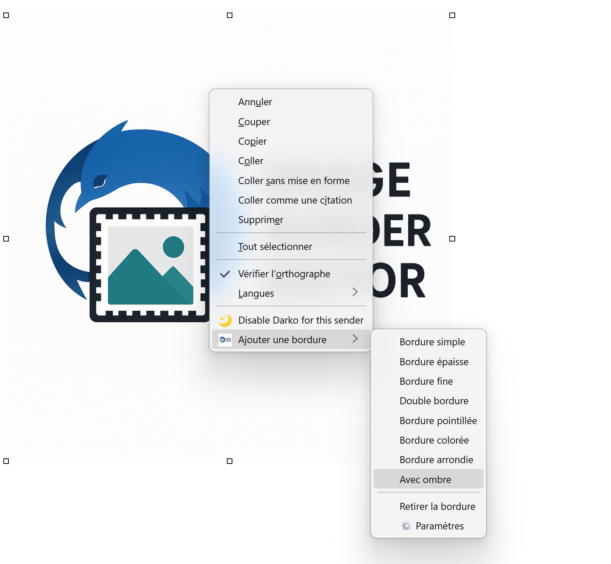
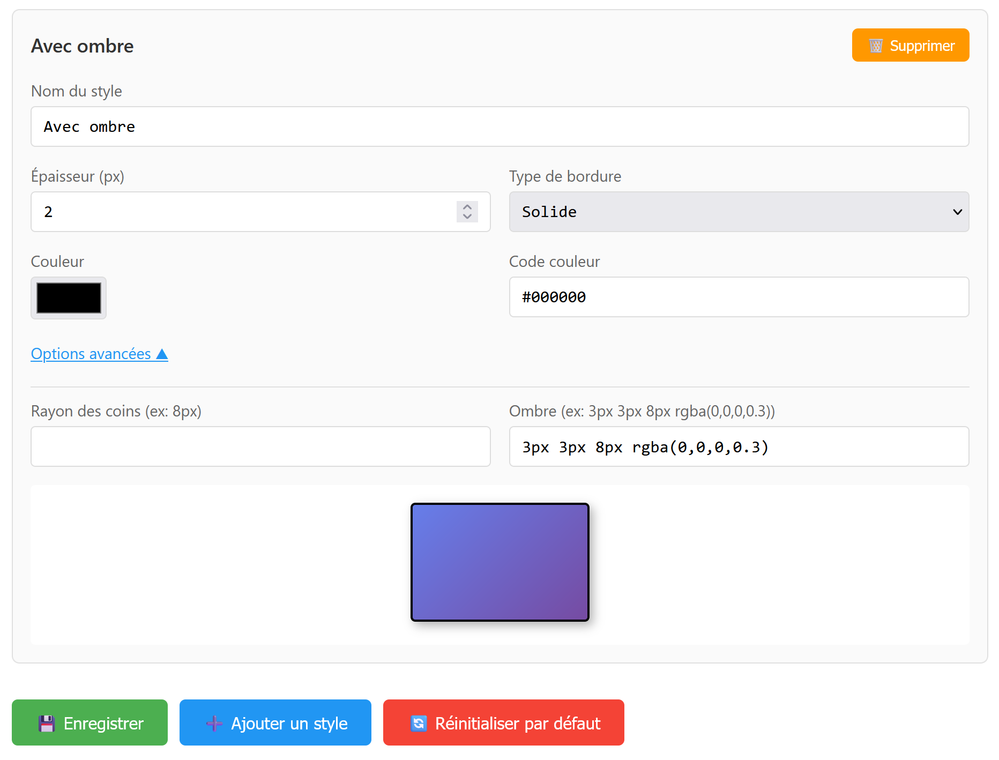

# 🖼️ Image Border Editor - Extension Thunderbird


Ajoutez facilement des bordures personnalisées aux images dans vos emails Thunderbird avec un simple clic droit !

## ✨ Fonctionnalités

- 🎨 **8 styles de bordures prédéfinis** : simple, épaisse, fine, double, pointillée, colorée, arrondie, avec ombre
- 🖱️ **Menu contextuel intégré** : clic droit sur une image → "Ajouter une bordure"
- ⚙️ **Configuration complète** : personnalisez tous les aspects de vos bordures
- 🎯 **Personnalisation avancée** :
  - Épaisseur (1-20px)
  - Type de bordure (solide, pointillée, double, etc.)
  - Couleur avec sélecteur visuel
  - Coins arrondis
  - Ombres portées
- ➕ **Styles personnalisés illimités** : créez et sauvegardez vos propres styles
- 👁️ **Prévisualisation en temps réel** : voyez le résultat avant de sauvegarder
- 🗑️ **Suppression facile** : retirez les bordures en un clic

## 📦 Installation

### Depuis le site officiel (recommandé)
1. Visitez la page de l'extension sur [Thunderbird Add-ons](https://addons.thunderbird.net/fr/thunderbird/addon/image-border-editor/)
2. Cliquez sur "Ajouter à Thunderbird"

## 📸 Captures d'écran




## 🚀 Utilisation

### Ajouter une bordure
1. Composez un nouvel email
2. Insérez une image (Insertion → Image)
3. Faites un **clic droit** sur l'image
4. Sélectionnez **"Ajouter une bordure"**
5. Choisissez un style dans le menu

### Retirer une bordure
1. Clic droit sur l'image avec bordure
2. Sélectionnez "Ajouter une bordure" → **"Retirer la bordure"**

### Personnaliser les styles
1. Clic droit sur une image → "Ajouter une bordure" → **"⚙️ Paramètres"**
2. Modifiez les styles existants ou créez les vôtres
3. Cliquez sur **"💾 Enregistrer"**

## 🎨 Styles prédéfinis

| Style | Description |
|-------|-------------|
| Bordure simple | Ligne noire fine de 1px |
| Bordure épaisse | Ligne noire épaisse de 4px |
| Bordure fine | Ligne grise claire de 1px |
| Double bordure | Double ligne noire de 3px |
| Bordure pointillée | Ligne pointillée de 2px |
| Bordure colorée | Ligne rouge/rose de 3px |
| Bordure arrondie | Ligne noire avec coins arrondis |
| Avec ombre | Ligne noire avec ombre portée |

## 🛠️ Structure du projet

```
image-border-editor/
├── manifest.json          # Configuration de l'extension
├── background.js          # Logique principale et menus contextuels
├── options.html          # Interface de configuration
├── options.js            # Code JavaScript de la page de configuration
├── icon-48.png           # Icône 48x48px
├── icon-96.png           # Icône 96x96px
└── README.md             # Ce fichier
```

## 🐛 Rapporter un bug

Si vous rencontrez un problème :
1. Vérifiez les [Issues existantes](https://github.com/Graf63/image-border-editor/issues)
2. Si le problème n'existe pas, [créez une nouvelle issue](https://github.com/Graf63/image-border-editor/issues/new)
3. Incluez :
   - Version de Thunderbird
   - Description détaillée du problème
   - Étapes pour reproduire
   - Captures d'écran si possible

## 💡 Demande de fonctionnalité

Vous avez une idée d'amélioration ? [Ouvrez une issue](https://github.com/Graf63/image-border-editor/issues/new) avec le tag `enhancement` !

## 🤝 Contribuer

Les contributions sont les bienvenues ! 

1. Forkez le projet
2. Créez une branche pour votre fonctionnalité (`git checkout -b feature/AmazingFeature`)
3. Committez vos changements (`git commit -m 'Add some AmazingFeature'`)
4. Pushez vers la branche (`git push origin feature/AmazingFeature`)
5. Ouvrez une Pull Request

## 📜 Licence

Ce projet est sous licence **Mozilla Public License 2.0**. Voir le fichier [LICENSE](LICENSE) pour plus de détails.

## 👤 Auteur

Créé avec ❤️ pour la communauté Thunderbird

## 🌟 Remerciements

- Merci à l'équipe Thunderbird pour leur excellente documentation
- Merci à tous les contributeurs et testeurs

## 📊 Changelog

### Version 1.0.0 (2025-01-XX)
- 🎉 Version initiale
- ✨ 8 styles de bordures prédéfinis
- ⚙️ Page de configuration complète
- 🎨 Personnalisation avancée des styles
- ➕ Création de styles personnalisés
- 👁️ Prévisualisation en temps réel

---

⭐ Si cette extension vous plaît, n'hésitez pas à mettre une étoile sur GitHub !

🐦 Suivez les mises à jour : [Releases](https://github.com/Graf63/image-border-editor/releases)
